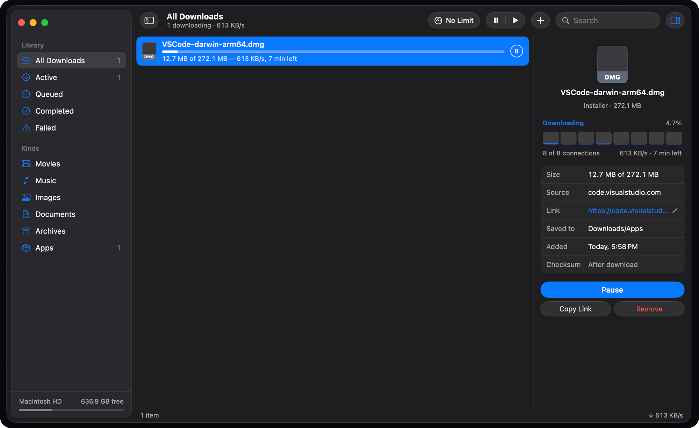

# Haul

[](https://github.com/sibiraj-s/haul/actions/workflows/ci.yml)

A native download manager for macOS, built with SwiftUI.



## Features

- Multi-connection downloads that pause and resume, including across relaunches
- A queue you can reorder, with a limit on simultaneous downloads
- Speed limit, a nightly download schedule, and pausing on Personal Hotspot
- Automatic retries, and fresh links for expired downloads (Update Link)
- Sorting into folders by kind, duplicate detection, SHA-256 checksums
- Menu bar progress, Dock progress, and notifications

## Install

Requires macOS 26 or later on Apple Silicon.

1. Download `Haul-<version>.dmg` from the [latest release](https://github.com/sibiraj-s/haul/releases/latest).
2. Open it and drag Haul to Applications.

Haul isn't signed with an Apple Developer ID, so macOS blocks it the first time you open it.
To allow it:

1. Open Haul. When macOS says it can't verify the app, click **Done**.
2. Go to **System Settings → Privacy & Security**, scroll to **Security**, and click
   **Open Anyway** next to the message about Haul.
3. Confirm with **Open Anyway** and your password.

After that, Haul opens normally. Alternatively, run this once in Terminal:

```sh
xattr -dr com.apple.quarantine /Applications/Haul.app
```

Haul checks for updates once a day. Install a new version the same way; you may need to allow it again.
